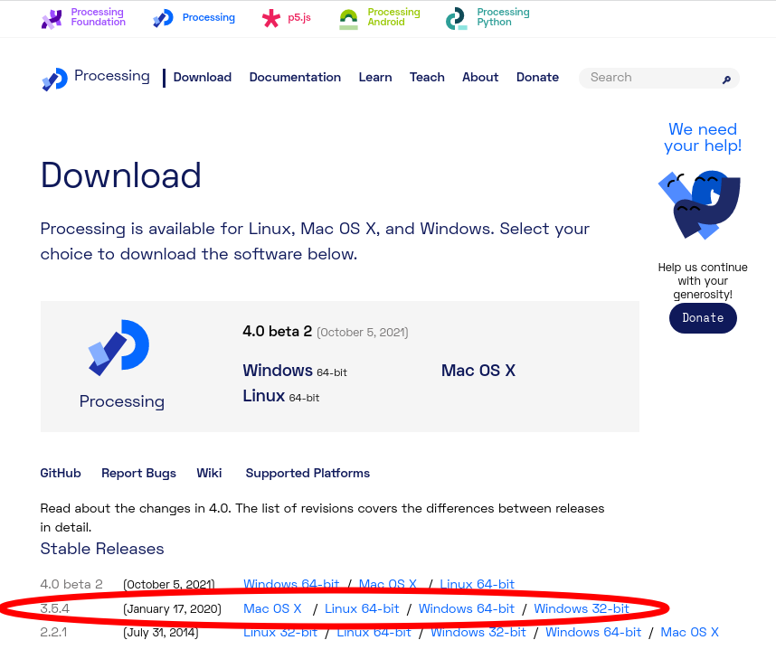
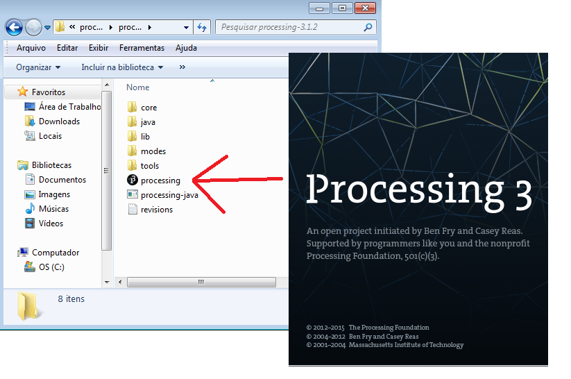
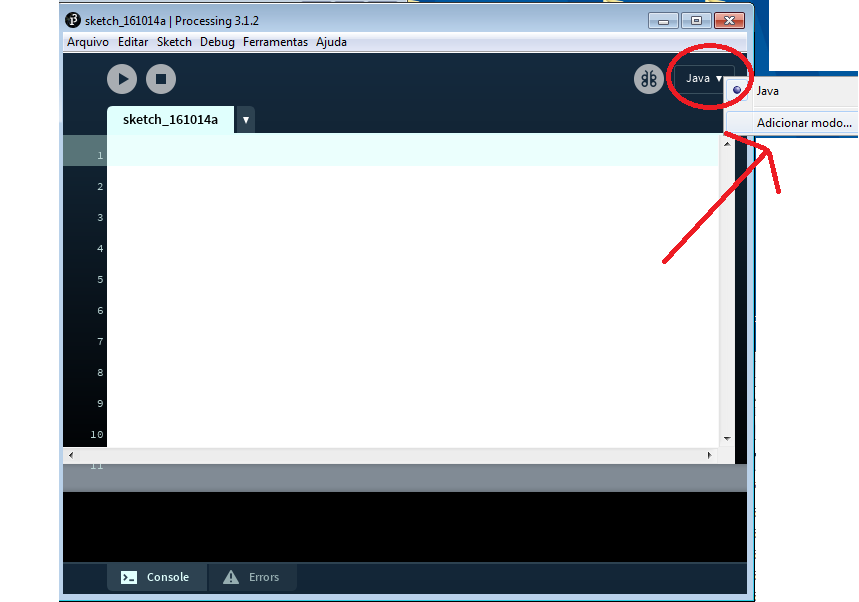
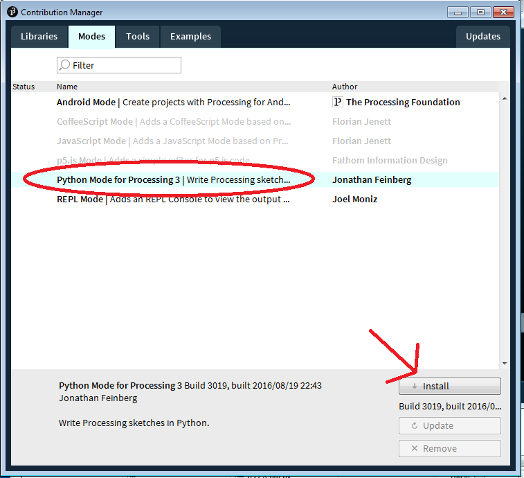
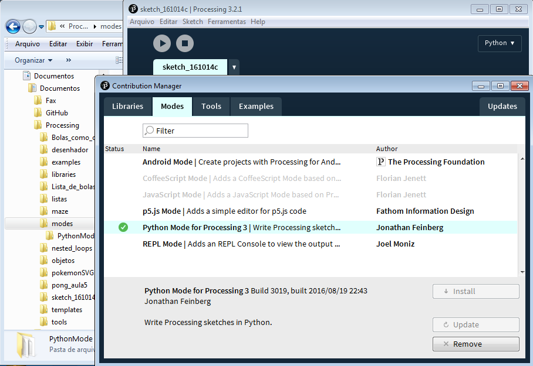
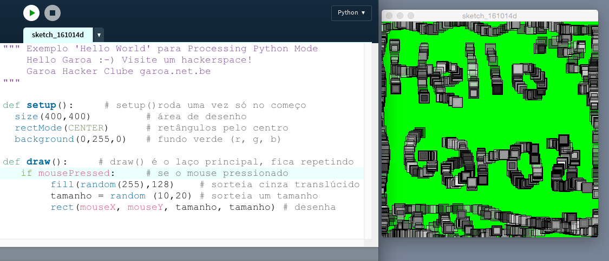

----

# Como instalar o Processing modo Python

[[English version](/index-EN.md)]

[**Processing**](http://processsing.org) é uma plataforma livre/aberta de programação criada em 2001 por Casey Reas e Ben Fry, largamente utilizada por artistas e para o ensino de programação num contexto visual. O Processing IDE (da sigla em inglês para ambiente integrado de desenvolvimento), simplificando, é um editor de texto apropriado para código, que permite executar programas escritos por você, conhecidos como *sketches*.

Processing permite não só criar programas que produzem imagens e eventualmente as exportar como bitmaps (PNG, JPG), animações ou arquivos vetoriais 2D e 3D (PDF, SVG e DXF entre outros), mas mais do que isso permite gerar executáveis, aplicativos autônomos e interativos, "empacotados" para Linux, macOS ou Windows. A comunidade desfruta de uma rico ecossistema de pessoas que produzem recursos como exemplos didáticos e bibliotecas de código livremente compartilhadas.

A versão ‘standard’ do Processing é baseada na linguagem de programação **Java**, mas hoje existem dois outros projetos importantes da [Fundação Processing](https://processing.org) que você pode querer conhecer:

-   [P5\*JS](https://p5js.org/) (baseado na linguagem **JavaScript)**;
-   [Processing Python Mode](https://py.processing.org/) (baseado em Jython, implementação da linguagem **Python** na JVM).

Ambos podem ser adicionados ao IDE tradicional. Vejamos a seguir **como instalar o Processing Modo Python**, que é o assunto desta página.

Entre na parte de downloads do site do Processing (<http://www.processing.org/download>), escolha o seu sistema operacional e baixe.

Saiba que não há um instalador, basta descomprimir, mova a pasta como um todo para onde preferir (não tire o executável da pasta) e abra o IDE. Veja como fica no Windows:

No macOS é praticamente a mesma coisa. No Linux, abra um terminal apontado para a pasta descomprimida do Processing e digite *./processing* (você pode querer executar também o *install.sh* que deve criar um atalho no desktop)

Lançado o IDE do Processing, procure no menu de modos o item *Adicionar modo…* (ou *Add mode…* se estiver em inglês)

Peça para instalar o modo Python \[Se esta etapa falhar, veja as observações mais abaixo].

Note que na pasta *Documentos* do usuário será criada uma pasta *Processing*, onde ficarão seus *sketches* (programas), ferramentas, modos e bibliotecas. No Linux a pasta criada se chama *sketchbook*. Este é o estado final quando a instalação terminou:

Observações: Caso não seja possível instalar o modo Python de dentro do IDE (redes com filtros ou proxies restritivas) você pode baixar, deszipar [PyhtonMode.zip](http://py.processing.org/3/PythonMode.zip) e colocar manualmente (no Windows e Mac OS) em *Documentos &gt; Processing &gt; modes &gt;* PythonMode. São dois problemas conhecidos: nomes de usuário com caracteres não-ASCII e firewalls podem atrapalhar o funcionamento do IDE.

PS: Que tal um programinha para testar?

[github.com/villares/py.processing-play](https://github.com/villares/py.processing-play)   

----

Alexandre B A Villares ([abav.lugaralgum.com](https://abav.lugaralgum.com)), [CC-BY-NC-SA-4.0 License](https://creativecommons.org/licenses/by-nc-sa/4.0/)
