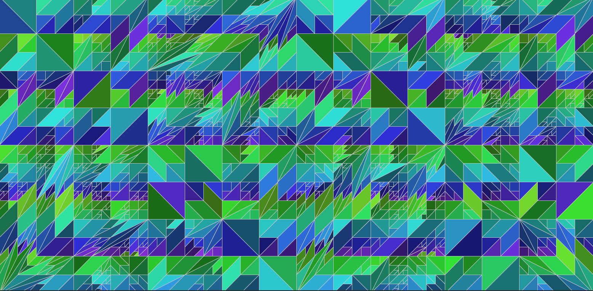

# Capa - E se o progresso for um retrocesso?



O código abaixo é a parte principal do código que gera as imagens nas capas deste título da coleção [*pensando amanhãs*](/) do Museu do Amanhã. Cada capa tem um desenho diferente, baseando em uma semente pseudo-aleatória diferente.

```python
import py5

# random seed (semente para os "sorteios" pseudo-aleatórios)
rnd_seed = 0  # este valor muda para cada capa

def setup():
    py5.size(1760, 764) 
    py5.no_stroke()
    py5.color_mode(py5.HSB)
    start_polygons()
    

def start_polygons():
    global poligonos
    HW = 390 # half width (meia largura)
    poligonos = [
        ((0, -HW), (HW * 2, -HW), (HW * 2, HW), (0, HW)),
        ((-HW * 2, -HW), (0, -HW), (0, HW), (-HW * 2, HW)),
    ]
    
def draw():
    py5.background(255)
    py5.translate(py5.width / 2, py5.height / 2)
    h = 0
    py5.stroke(0)
    for shp in poligonos:
        py5.begin_shape()
        xc, yc = centroide(shp)
        w, h = py5.width, py5.height
        c = py5.color(64 + (yc * 0.9) % 128,
                      200,
                      100 + (py5.dist(xc, yc, 0, 0) * 1.0) % 128)        
        py5.fill(c)
        py5.stroke_weight(1)
        py5.stroke(200)       
        py5.vertices(shp)
        py5.end_shape(py5.CLOSE)

def dividir_quad(q):
    d1 = py5.dist(*q[0], *q[2])
    d2 = py5.dist(*q[1], *q[3])
    if py5.random_int(1, 2) == 1: # or q[0][1] < 0: 
        return q[:3], q[2:] + q[:1]
    else:
        return q[1:4], q[3:] + q[:2]

def dividir_tri(t):
    b, c, a = t
    ab = centroide((a, b))
    bc = centroide((b, c))
    ca = centroide((c, a))
    return (
        (ab, a, ca),
        (ab, b, bc),
        (ca, ab, bc, c),
    )

def centroide(s):
    xs, ys = zip(*s)
    return (sum(xs) / len(xs),
            sum(ys) / len(ys))

def key_pressed():
    global rnd_seed
    start_polygons()
    if py5.key == ' ':
        py5.random_seed(rnd_seed)
        for _ in range(7):
            dividir_poligonos()
        rnd_seed += 1
       
def dividir_poligonos():
    novos_poligonos = []
    for p in poligonos:
        novos_poligonos.extend(dividir(p))
    poligonos[:] = novos_poligonos


def dividir(p):
    if len(p) == 4:
        return dividir_quad(p)
    else:
        return dividir_tri(p)

py5.run_sketch()

```