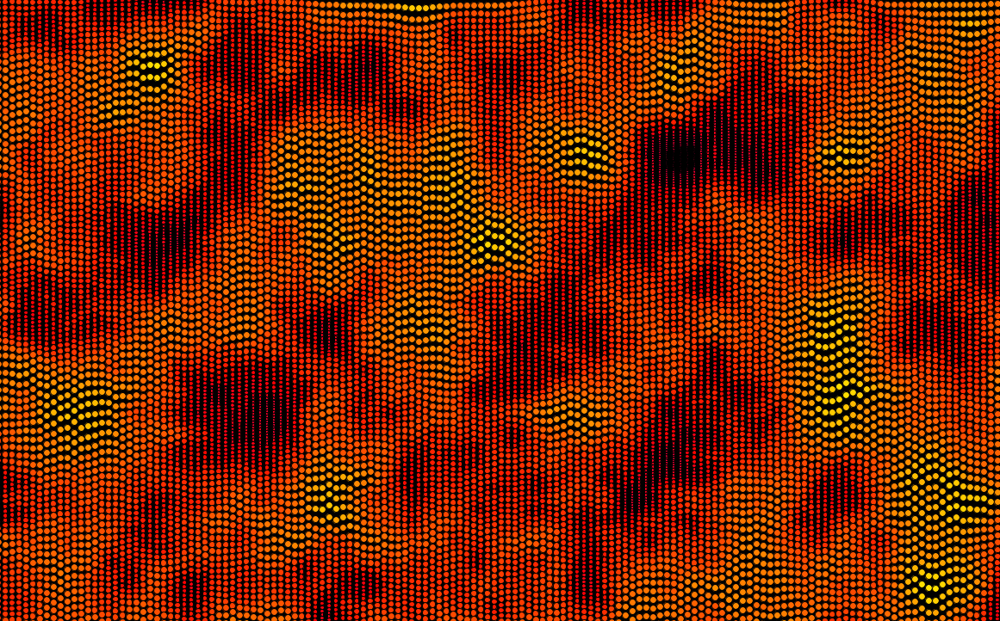

# Capa - Viver mais significa viver bem?



O código abaixo é a parte principal do código que gera as imagens nas capas deste título da coleção [*pensando amanhãs*](/) do Museu do Amanhã. Cada capa tem um desenho diferente, baseando em uma semente pseudo-aleatória diferente.

```python
# Originalmente este código cabia em um "tweet" #つぶやきProcessing
import py5 

# noise seed (semente para os "sorteios" do Perlin Noise)
n_seed = 1  # este valor muda para cada capa
margem = 15

def setup():
    py5.size(1760, 764)

def draw():
    py5.noise_seed(n_seed)
    py5.fill(0)
    py5.rect(margem, margem, py5.width - margem * 2, py5.height - margem * 2)
    py5.color_mode(py5.HSB)
    f =  0 # use 'f = frame_count' para versão animada
    x = margem
    while x < py5.width - margem:
        y = margem
        while y < py5.height - margem:
            h = 18 * py5.noise(x * 0.01, (y + f) * 0.01, f * 0.01)
            py5.fill((235 + h * 4) % 255, 255, 255)
            py5.ellipse(x, y, min(8, h), min(8, h))
            y += h
        x += 8  
            
py5.run_sketch()
```