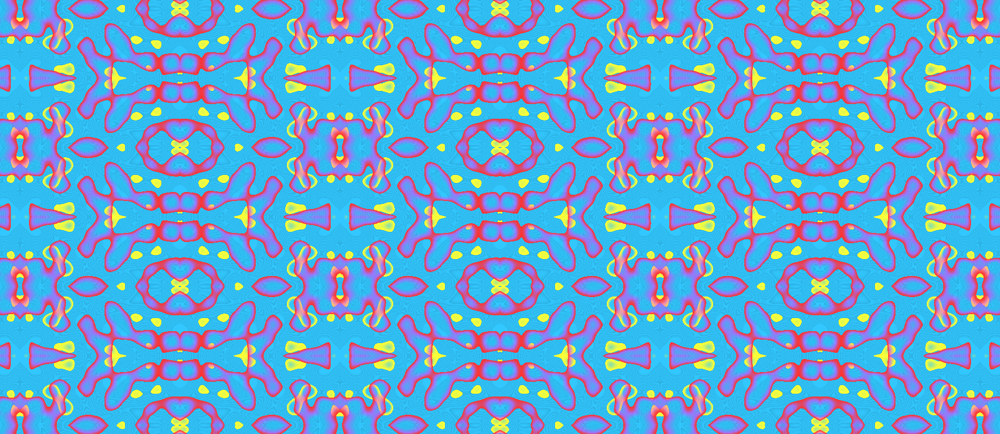

# Capa - Sonhar transforma o mundo?



O código abaixo é a parte principal do código que gera as imagens nas capas deste título da coleção [*pensando amanhãs*](/README.md) do Museu do Amanhã. Cada capa tem um desenho diferente, baseando em uma semente pseudo-aleatória diferente.

```python
import py5
import numpy as np
 
# noise seed (semente para o OpenSimplex Noise)
n_seed = 1 # este valor muda para cada capa
escala_noise = 0.003

def setup():
    py5.size(1760, 764)
    cor_fundo = py5.color(50, 200, 255)  # azul fundo
    azulejo = py5.create_graphics(py5.width, py5.height)
    vazios = [py5.color(0, 0, 0, 0)] * 16 # bloco de "cores" transparentes
    vermelhos = [py5.color(255, 50, 50 + a ** 2, 255 - a * 8) for a in range(32)]
    cores_frente = vazios * 5 + vermelhos + vazios * 2
    amarelos = [py5.color(255, 255, 50, 255 - a ** 2) for a in range(32)]
    escuros_tranlucidos = [py5.color(0, 0, 0, a * 4) for a in range(8)]
    cores_fundo = amarelos + escuros_tranlucidos * 10 + amarelos
    mapa_frente = array_rgba(cores_frente)
    mapa_fundo =  array_rgba(cores_fundo)
    mesh_x, mesh_y = np.meshgrid(
        np.arange(0, azulejo.width, 1) * escala_noise,
        np.arange(0, azulejo.height, 1) * escala_noise
    )
    py5.background(cor_fundo)
    py5.os_noise_seed(n_seed)  
    py5.translate(py5.width // 2, py5.height // 2)
    offset = 0
    for cores in (mapa_fundo, mapa_frente):
        valores_noise = py5.os_noise(mesh_x, mesh_y, offset + 2 * n_seed)
        indices = py5.remap(valores_noise, -1, 1, 0, len(cores)).astype(np.uint8)
        with py5.push_matrix():
            py5.scale(0.16)
            azulejo.begin_draw()
            azulejo.set_np_pixels(cores[indices], bands="ARGB")
            azulejo.end_draw()
            img = azulejo.copy()
            w, h = img.width, img.height
            for y in range(-h * 3, h * 3 + 1, h * 2):
                for x in range(-w * 3, w * 3 + 1, w * 2):
                    py5.image(img, x, y, w, h)
                    py5.scale(1,-1)
                    py5.image(img, x, y, w, h)
                    py5.scale(-1, 1)
                    py5.image(img, x, y, w, h)
                    py5.scale(1,-1)
                    py5.image(img, x, y, w, h)
        offset += 10000

def array_rgba(cores):
    return np.dstack((
        [c >> 24 & 0xFF for c in cores],
        [c >> 16 & 0xFF for c in cores],
        [c >> 8 & 0xFF for c in cores],
        [c & 0xFF for c in cores]
        ))[0]

py5.run_sketch()
```