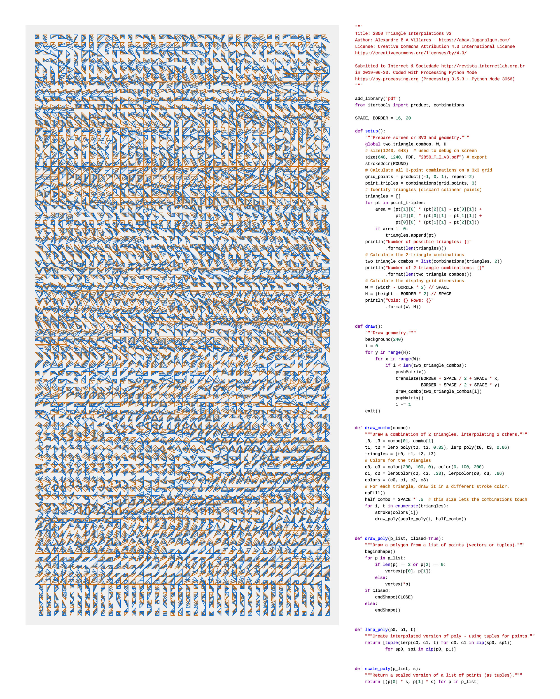
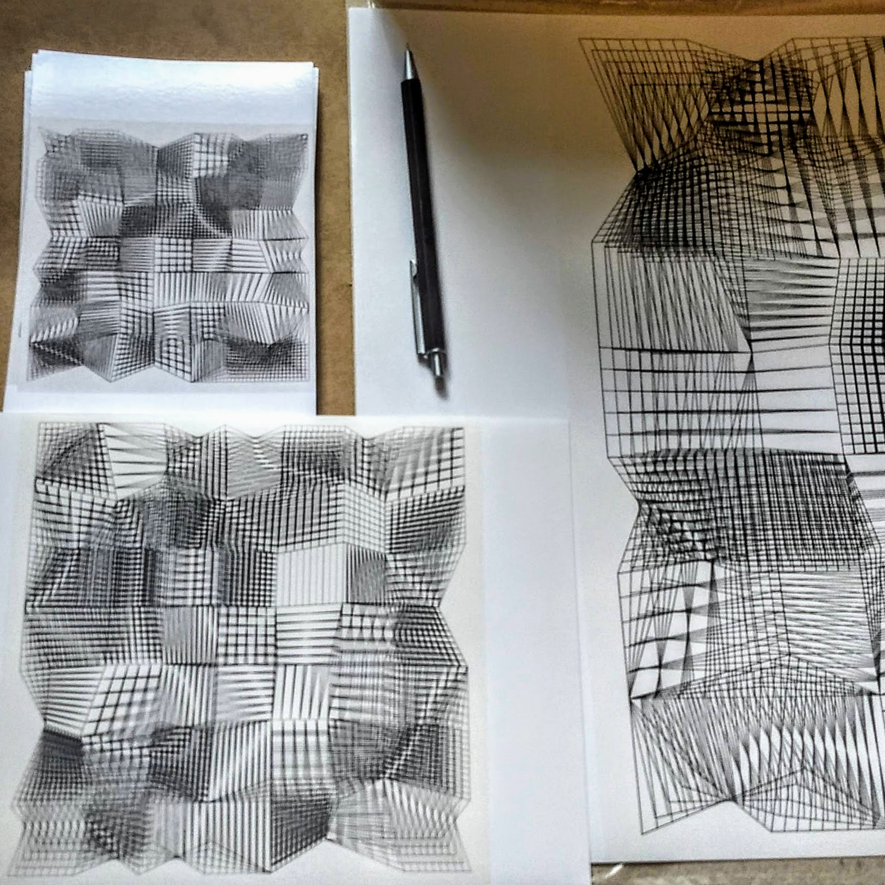
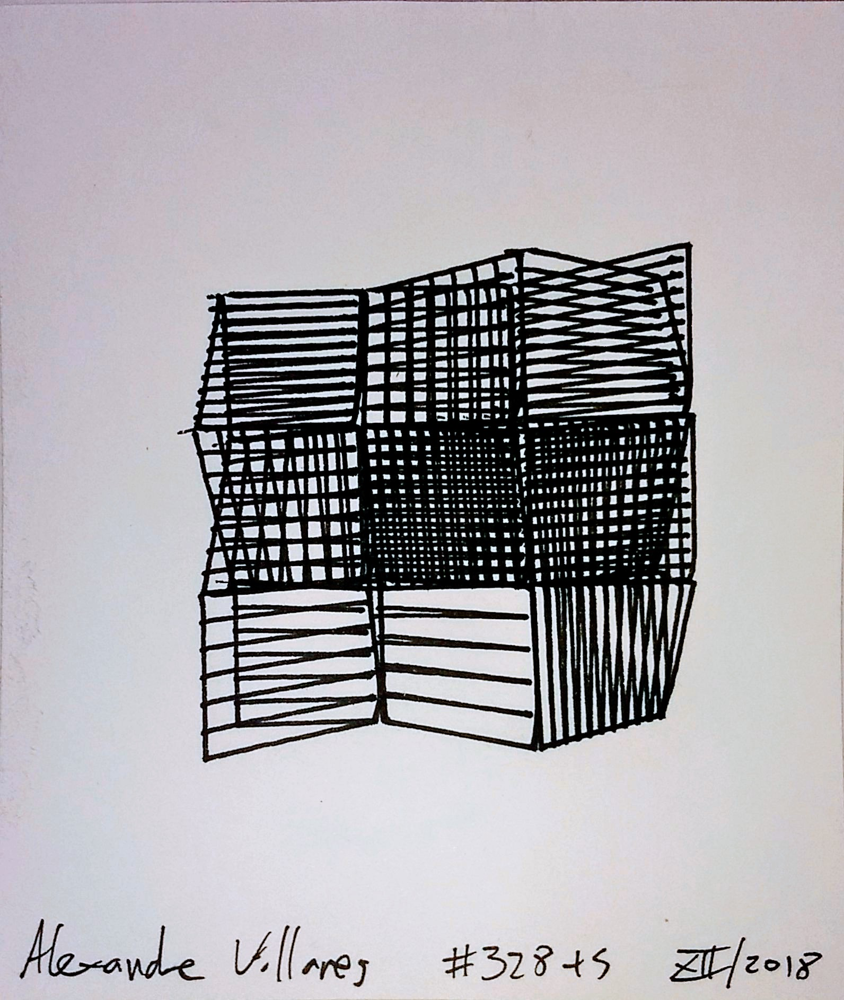
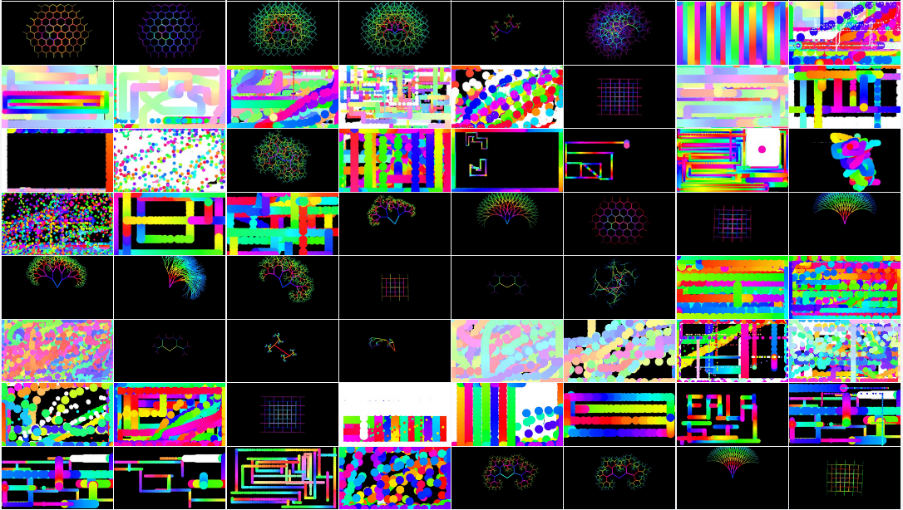

----

## trabalhos selecionados

---

### *2850 Triangle Interpolations v3*, 2019

**2850  interpolações de triângulos v3** é uma obra publicada na revista *Internet & Sociedade*, n. 1 , v. 1 , janeiro de 2020, p. 340 a 344 (acessível em [revista.internetlab.org](http://revista.internetlab.org))

> "Uma obra de artes visuais no domínio das novas mídias, pode também  ser descrita como uma obra algorítmica. Executada no contexto da  exploração gráfica da combinatória de elementos por meio da  programação. Reflete também preocupações do autor com o  compartilhamento do conhecimento, licenciamento de artefatos culturais,  uso de ferramentas livres, acesso ao código fonte e desmistificação  dos procedimentos algorítmicos."

### Série s328, 2018—2020

Série de obras algorítmicas, ou comptacionais, com origem nos estudos diários do projeto *sketch-a-day* em 2018, e cujos desobramentos permitiram variantes em movimento, desenhos realizados com plotter de caneta e impressões únicas em papel fotográfico.

Têm como princíplio uma sequência de procedimentos que deformam duas grades de quadrados com múltiplas subdivisões, interpolando grades intermediárias, produzindo estruturas gráficas de leitura tridimensional.

###### a328_2020 (impressões em papel fotográfico, diversas dimensões)

As impressões em papel fotográfico são sempre únicas, utilizando uma semente pseudo-aleatória anotada, para evitar duplicações.

###### s328 + S (variante simplificada para pen plotter )

### desenho()  *ou desenho sem argumentos*, 2019

Publicação independente de desenho e programação, uma mistura de fanzine, fôlder e pôster, cada exemplar é único.

Foram impressos inicialmente 200 em sua primeira edição (`desenho() #0 outubro 2019`) distribuída gratuitamente na conferência  Python Brasil 2019, graças a um financiamento coletivo. Agradecimentos e mais informações em [desenho.lugaralgum.com](http://desenho.lugaralgum.com:). 

### Projeto *sketch-a-day* , 2018—em curso

**[abav.lugaralgum.com/sketch-a-day](http://abav.lugaralgum.com)**

Neste experimento artístico ainda em curso, iniciado em janeiro de 2018, são publicados esboços, *sketches*, ideias visuais expressadas por meio de programação diariamente, sempre acompanhados do código fonte.  

****

### Lousa mágica e Lousa paramétrica, 2017—2018

[**abav.lugaralgum.com/lousa-magica**](https://abav.lugaralgum.com/lousa-magica/)

- [vídeo de 2017](https://www.youtube.com/watch?v=D5Ha1bhqBuQ)

A *Lousa mágica* foi apresentada inicialmente em conjunto com as atividades do [Estúdio Hacker](http://estudiohacker.io) na inauguração do Sesc 24 de Maio, em agosto de 2017 (vídeo acima).  Usando 6 potenciômetros, permitia desenhar e o desenho podia ser apagado tombando a caixa de controle. No evento, era possível também postar *tweets* com o desenho.

Para o Circuito Sesc de Artes, em 2018, foram feitas montagens com 4 potenciômetros com uma variante do software da *Lousa mágica* e uma versão nova chamada *Lousa paramétrica* com um desenho paramétrico recursivo de uma árvore. Que foram apresentadas ao público por Monica Rizzolli e João Adriano no contexto das atividades *Máquinas de Desenhar no Circuito SESC de Artes 2018.* 

> Amostra dos desenhos produzidos pelo público (principalmente crianças).

### Matriz 8x8 animada com Arduino, 2016

Trabalho produzido em colaboração com **Tiago Queiroz** para a exposição coletiva *Zonas de compensação 3.0*, de 5 a 21 de outubro de 2016 na Galeria do Instituto de Artes da Unesp, em São Paulo.

A obra  implementa uma conjunto 'curado'  de regras do *autômato celular de Wolfram*  em uma matriz de LED, apresentada com o código fonte, que também fica disponível no repositório [WolframCellularAutomataArduino](https://github.com/villares/WolframCellularAutomataArduino/blob/master/WolframCellularAutomataArduino.ino).

