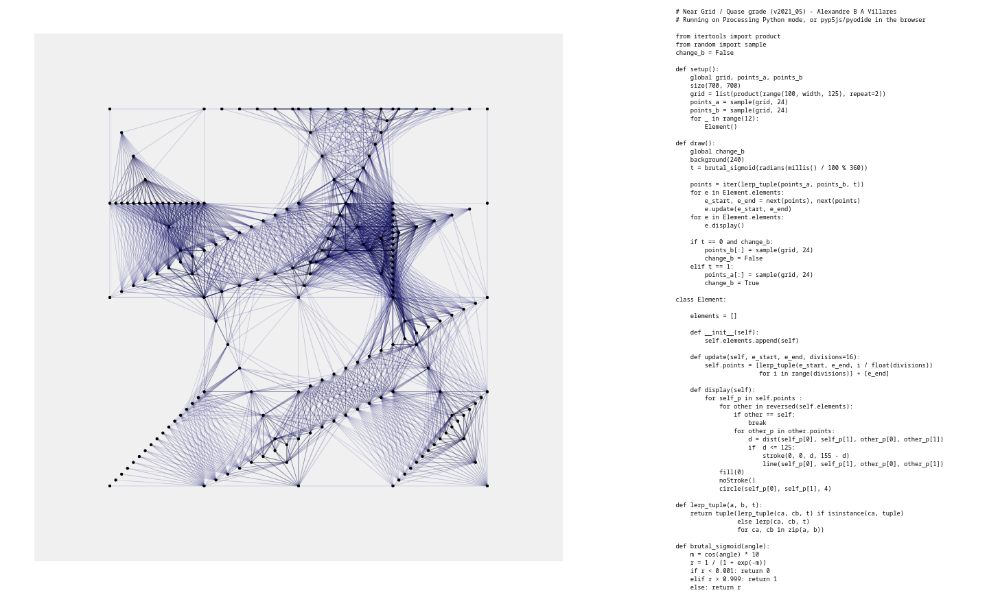
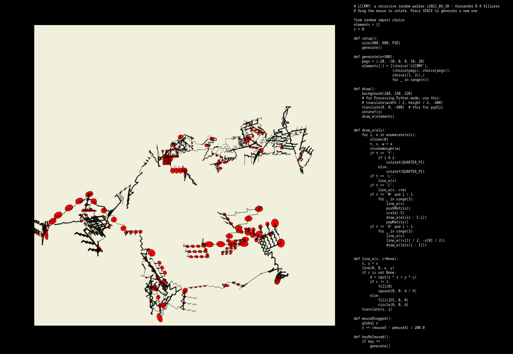
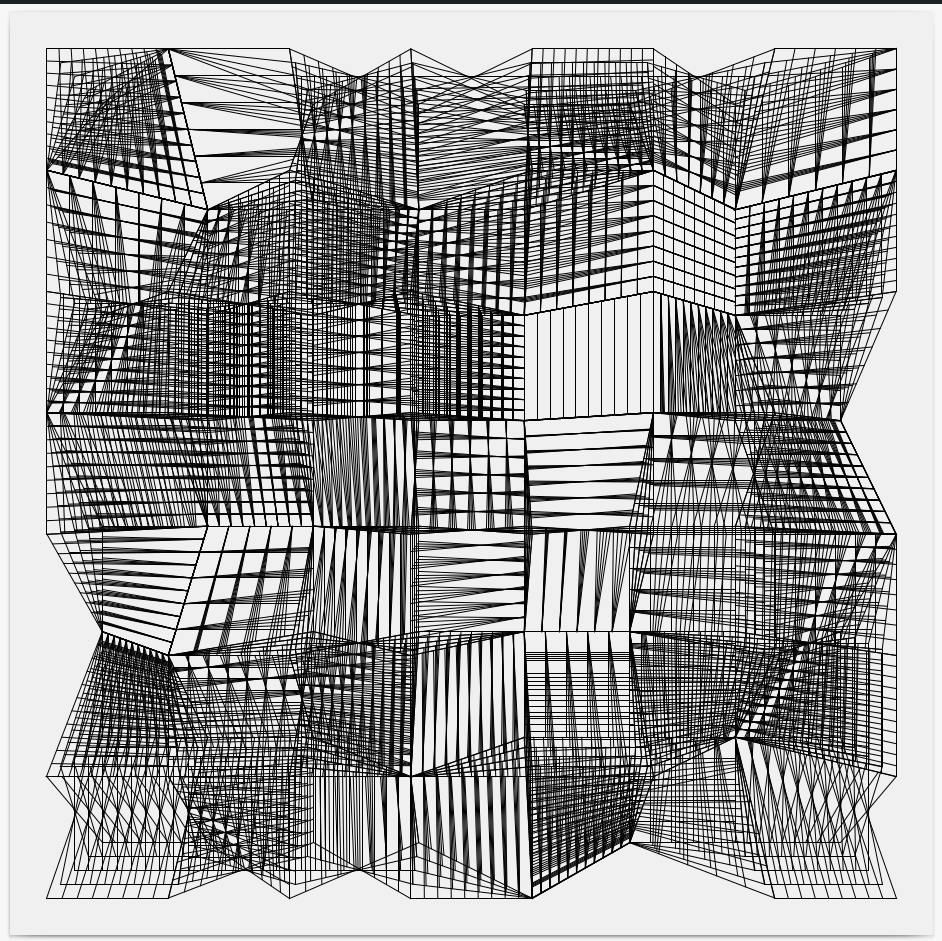

# toc

# obras selecionadas

<sub>[English version](index-EN.md)</sub>

---

### Escolas no Brasil

Obra foi publicada na revista *Internet e Sociedade,* n.2, v.2, dezembro de 2021, acessível em [**revista.internetlab.org/escolas-no-brasil**](https://revista.internetlab.org/escolas-no-brasil).

 

``` python
"""
Inspirado em uma demonstração feita pelo professor Fernando Massanori, este desenho
é produzido a partir de microdados do censo escolar 2020 que podem ser encontrados em
https://www.gov.br/inep/pt-br/acesso-a-informacao/dados-abertos/microdados/censo-escolar
Varrendo cada uma das 181279 escolas em funcionamento encontradas nos dados,
dispostas em uma grade invisível, círculos verdes e azuis variam conforme o número de
computadores disponíveis para os alunos, desktop e portateis respectivamente, os
quadrados vazados nestas mesmas cores resultam de entradas possívelmente incorretas
indicadas como 88888 na tabela. Quadrados pretos vazados são causados por escolas sem
Internet banda larga e quadrados pretos cheios por escolas sem energia elétrica.
"""

import pandas as pd
import py5

escolas =  pd.read_csv('escolas2.csv', sep='\t', low_memory=False)
print(f'total de registros: {len(escolas)}')
filtro = escolas['TP_SITUACAO_FUNCIONAMENTO'] == 1
escolas_funcionando = escolas[filtro]
computadores = escolas_funcionando['QT_DESKTOP_ALUNO']
portateis = escolas_funcionando['QT_COMP_PORTATIL_ALUNO']
internet_bl = escolas_funcionando['IN_BANDA_LARGA']
sem_luz = escolas_funcionando['IN_ENERGIA_INEXISTENTE']

escala = 2

def plot(x, y, n, cor, internet=False):
    py5.stroke(*cor)
    py5.no_fill()
    if n != n or (internet and n):  # filter* NaN
        pass
    elif internet and n == 0:
        py5.square(x * escala, y * escala, escala)
    elif n == 88888:
        py5.square(x * escala, y * escala, escala * 1.5)
    else:
        py5.circle(x * escala, y * escala, n * escala / 10)

def setup():
    py5.size(426 * 2, 426 * 2, py5.PDF, 'desenho2.pdf')
    py5.background(255)
    py5.stroke_weight(0.3)
    py5.rect_mode(py5.CENTER)
    x = y = 0
    for c, p, sbl, sl in zip(computadores, portateis, internet_bl, sem_luz):
        if sl == 1:        
            py5.fill(0)
            py5.no_stroke()
            py5.square(x * escala, y * escala, escala)  # sem luz, quadrado preto
        plot(x, y, c, (0, 200, 0))    # computadores desktop para alunos em verde
        plot(x, y, p, (0, 0, 200))    # computadores portáteis em azul            
        plot(x, y, sbl, (0, 0, 0), True)  # sem banda larga, quadrado preto vazado
        x += 1
        if x > 426:
            x = 0
            y += 1
    print('FIM')

py5.run_sketch()
```

---

### Near Grid / quase grade, 2021

[Obra na web-exposição EmMeio#13: Contaminações do MediaLab UnB, 2021](https://emmeio13.medialab.unb.br/near-grid/) 



>  Linhas desenhadas dinamicamente entre pontos em um limite de aproximação formam uma quase grade. Arranjos randômicos de pontos são animados por transições para novos arranjos seguindo sempre a mesma regra de construção: 12 pares de pontos (de uma grade 5 por 5 de 25 pontos) definem os objetos, virtualmente 
> subdivididos em 16 pontos, e cada um destes objetos deve ser ligado a  outros quando seus pontos estão dentro da distância limite, a mesma do espaçamento da grade. O código que produz e anima o desenho integra a visualização da obra.

-> [Para ver a obra em movimento e em tela cheia no navegador](https://abav.lugaralgum.com/selected-work/near_grid_v2021_05/)

---

### LCCRMY: A RECURSIVE RANDOM WALKER

[Obra exposta em Homeostasis Lab](https://homeostasislab.org/)



>  Da mesma forma com que muitos pintores sentem necessidade de produzir a própria tinta, artistas que produzem obras em meios digitais escrevem código, tem o software como meio. 'LCCRMY: a recursive random walker' explora duas ideias recorrentes neste meio, os caminhantes aleatórios (random walkers) e a recursividade, gerando estruturas tridimensionais com elementos repetidos em ritmos e escalas diversas. A estratégia adotada tem influência dos Sistemas de Lindenmayer (L-Systems) na composição de uma sequência de símbolos que é executada na forma de desenho, mas não  se trata de um L-System, como pode ser verificado no código-fonte que é apresentado simultaneamente à sua execução no navegador.

-> [Para ver a obrar interativa no navegador](https://abav.lugaralgum.com/selected-work/LCCRMY_v2021_04_30/) 

---

### *2850 Triangle Interpolations v3*, 2019

Obra publicada na revista *Internet & Sociedade*, n. 1, v. 1 , janeiro de 2020, p. 340 a 344, acessível em **[revista.internetlab.org](https://revista.internetlab.org)**.

> 
> 
> "Uma obra de artes visuais no domínio das novas mídias, pode também  ser descrita como uma obra algorítmica. Executada no contexto da  exploração gráfica da combinatória de elementos por meio da  programação. Reflete também preocupações do autor com o  compartilhamento do conhecimento, licenciamento de artefatos culturais,  uso de ferramentas livres, acesso ao código fonte e desmistificação  dos procedimentos algorítmicos."

---

### Série s328, 2018—2020



Série de obras algorítmicas, ou computacionais, com origem nos estudos diários do projeto *sketch-a-day* em 2018, e cujos desobramentos permitiram variantes em movimento, desenhos realizados com plotter de caneta e impressões únicas em papel fotográfico.

Têm como princípio uma sequência de procedimentos que deformam duas grades de quadrados com múltiplas subdivisões, interpolando grades intermediárias, produzindo estruturas gráficas de leitura tridimensional.

> 
> 
> s328 + S (variante simplificada para pen plotter )

Foram realizadas impressões em papel fotográfico, sempre únicas, utilizando uma semente pseudo-aleatória anotada, para identificar, registrar quais foram impressas, e evitar duplicações.

> 
> 
> a328_2020 (impressões em papel fotográfico, diversas dimensões)

---

### desenho(), 2019

> 
> 
> Uma mistura de fanzine, fôlder e pôster, cada exemplar é único.

**desenho()**,  ou *desenho sem argumentos*,  é uma publicação independente de desenho e programação. Em sua primeira edição (`desenho() #0 outubro 2019`), foram impressos inicialmente 200 exemplares,  graças a um financiamento coletivo, distribuídos gratuitamente na conferência  Python Brasil 2019, en Ribeirão Preto.

Agradecimentos e mais informações em **[desenho.lugaralgum.com](https://desenho.lugaralgum.com:).** 

---

### sketch 190514c, 2019

> 
> 
> Poster 190414c impresso em risografia

Impressão em risografia de um *sketch*, tiragem de 30 exemplares. Inclui o código que produz a imagem. 

---

### Projeto *sketch-a-day* , 2018—em curso

Neste experimento artístico iniciado em janeiro de 2018, são publicados esboços, *sketches*, ideias visuais expressadas por meio de programação diariamente, sempre acompanhados do código fonte em **[abav.lugaralgum.com/sketch-a-day](https://abav.lugaralgum.com)**.


---

### Lousa mágica e Lousa paramétrica, 2017—2018

> [](https://www.youtube.com/watch?v=D5Ha1bhqBuQ)
> 
> Vídeo da Lousa mágina no Sesc 24 de maio - crédito: [João Adriano Freitas](https://github.com/jaafreitas)

A *Lousa mágica* foi apresentada inicialmente em conjunto com as atividades do [Estúdio Hacker](https://estudiohacker.io) na inauguração do Sesc 24 de Maio, em agosto de 2017 (vídeo acima).  Usando 6 potenciômetros, permitia desenhar e o desenho podia ser apagado tombando a caixa de controle. No evento, era possível também postar *tweets* com o desenho.

Para o Circuito Sesc de Artes, em 2018, foram feitas novas montagens com 4 potenciômetros com uma variante do software da *Lousa mágica* e uma versão nova chamada *Lousa paramétrica* com um desenho paramétrico recursivo de uma árvore. Que foram apresentadas ao público por Monica Rizzolli e João Adriano Freitas no contexto das atividades *Máquinas de Desenhar no Circuito SESC de Artes 2018.* 

Código e instruções de montagem em [**abav.lugaralgum.com/lousa-magica**](https://abav.lugaralgum.com/lousa-magica/).


> Amostra dos desenhos produzidos pelo público (principalmente crianças).

---

### Matriz 8x8 animada com Arduino, 2016

Trabalho produzido em colaboração com **Tiago Queiroz** para a exposição coletiva *Zonas de compensação 3.0*, de 5 a 21 de outubro de 2016 na Galeria do Instituto de Artes da Unesp, em São Paulo.

A obra  implementa uma conjunto 'curado'  de regras do *autômato celular de Wolfram*  em uma matriz de LED, apresentada com o código fonte, que também fica disponível no repositório [WolframCellularAutomataArduino](https://github.com/villares/WolframCellularAutomataArduino/blob/master/WolframCellularAutomataArduino.ino).


