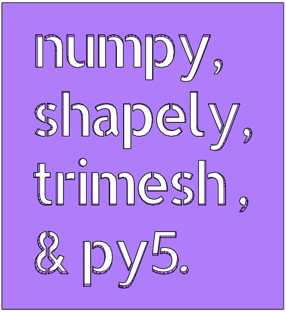

# Fab four Python libraries

Extract font contours and make 3D meshes out of them with py5 [py5coding.org](https://py5coding.org) and friends!





```python
"""
Extract font contours and make 3D meshes out of them with py5 <py5coding.org>
and friends!

- polys_from_text(words, font: py5.Py5Font)
  produces a shapely.GeometryCollection (containing MultiPolygons for each glyph)

- extrude_polys(polys, depth)
  produces a trimesh.Trimesh 3D mesh from shapely geometries

- ...if you run this as main, you get a demo.
    's' key will save an STL file.
    'f' key will flip the Y axis of the mesh.
    'k' key will toggle the "alternate" spacing mode.
"""

import py5
import numpy as np
import shapely
import trimesh

def polys_from_text(
    words: str,
    font: py5.Py5Font,
    leading: float = None, 
    alternate_spacing=False,
    space_width=None
    ) -> shapely.GeometryCollection:
    """
    Produce from a string a shapely GeometryCollection containing
    MultiPolygons for each glyph. The MultiPolygon.geoms contains
    one or more shapely.Polygon objects (which can have holes).
    New-line chars will try to move text to a new line.
    
    The alternate_spacing option will pick the glyph
    spacing from py5.text_width() for each glyph, it can be
    too spaced, but good for monospaced font alignment.
    """
    # Use the font size as leading value if none is provided.
    leading = leading or font.get_size()
    py5.text_font(font)
    space_width = space_width or py5.text_width(' ')
    results = []
    x_offset = y_offset = 0
    for c in words:
        if c == '\n':
            y_offset += leading
            x_offset = 0  # this assumes left aligned text...
            continue
        # # Add this for the exact hacky demo output I had...
        # if c == ',':
        #     x_offset -= 7
        glyph_pt_lists = [[]] # starts with an empty list inside
        # font.get_shape(c, 1) will trigger a "Need to call beginShape() first"
        # Processing warning you can safely ignore.
        c_shp = font.get_shape(c, 1)  
        vs3d = [c_shp.get_vertex(i)
                for i in range(c_shp.get_vertex_count())]
        vs = set()
        for vx, vy, _ in vs3d:
            x = vx + x_offset
            y = vy + y_offset
            glyph_pt_lists[-1].append((x, y))
            if (x, y) not in vs:
                vs.add((x, y))
            else:
                glyph_pt_lists.append([]) # note this leaves trailling empty list
        if alternate_spacing:
            w = py5.text_width(c) if c != ' ' else space_width
        else:
            w = c_shp.get_width() if vs3d else space_width
        x_offset += w
        # filter out elements with less than 3 points 
        # and stop one item before the trailling empty list
        glyph_polys = [shapely.Polygon(p)
                       for p in glyph_pt_lists[:-1] if len(p) > 2]
        if glyph_polys:  # there are still empty glyphs at this point
            glyph_shapes = process_glyphs(glyph_polys)
            results.append(glyph_shapes)
    return shapely.GeometryCollection(results)

def process_glyphs(polys: list[shapely.Polygon]) -> shapely.MultiPolygon:
    """
    Try to subtract the shapely Polygons from glyph contours
    in order to produce appropriate looking glyphs with holes.
    """
    polys = sorted(polys, key=lambda p: p.area, reverse=True)
    results = [polys[0]]
    for p in polys[1:]:
        # works on edge cases like â and ®
        for i, earlier in enumerate(results):
            if earlier.contains(p):
                results[i] = results[i].difference(p)
                break
        else:   # the for-loop's else only executes after unbroken loops
            results.append(p)
    return shapely.MultiPolygon(results).buffer(0.15)

def extrude_polys(
    polys: shapely.Polygon | shapely.MultiPolygon | shapely.GeometryCollection,
    depth: float) -> trimesh.Trimesh:
    """
    Extrude a GeometryCollection, Polygon or MultiPolygon
    """
    if isinstance(polys, shapely.Polygon):
        return trimesh.creation.extrude_polygon(polys, depth)
    elif isinstance(polys, (shapely.MultiPolygon, shapely.GeometryCollection)):
        return trimesh.util.concatenate([
            extrude_polys(geom, depth) for geom in polys.geoms
            if isinstance(geom, (shapely.MultiPolygon, shapely.Polygon))
            ])

def draw_mesh(m):
    """Desenha malha trimesh reduzindo arestas coplanares."""
    vs = m.vertices
    bs = m.facets_boundary
    # desenha as faces trianguladas sem as arestas
    py5.push_style()  # para poder reverter o desligamento do traço
    py5.no_stroke()   # desliga o  traço, some com as arestas
    with py5.begin_closed_shape(py5.TRIANGLES):
        py5.vertices(vs[np.concatenate(m.faces)])
    py5.pop_style()
    # desenha apenas as linhas dos limites das facetas
    a, b = np.vstack(bs).T
    py5.lines(np.column_stack((vs[a], vs[b])))

if __name__ == '__main__':
    
    # Know your installed stencil fonts!
    for font_name in py5.Py5Font.list():
        if 'stencil' in font_name.lower():
            print(font_name)
    
    alternate_spacing = False
    space_width = 10 # this was good for Allerta
    save = False
    #FONT, TEXT_SIZE = 'Saira Stencil One Regular', 50
    FONT, TEXT_SIZE = 'Allerta Stencil Regular', 55
    #FONT, TEXT_SIZE = 'Big Shoulders Stencil Bold', 50
    
    def setup():
        global margin, f, t
        py5.size(500, 500, py5.P3D)                
        f = py5.create_font(FONT, TEXT_SIZE)
        t = 'numpy,\n' \
            'shapely,\n' \
            'trimesh ,\n' \
            '& py5.' 
        calculate_slab()
        
    def calculate_slab():
        global slab
        holes = polys_from_text(
            t, f, leading=TEXT_SIZE + 10,
            alternate_spacing=alternate_spacing,
            space_width=space_width,
            )
        min_x, min_y, max_x, max_y = holes.bounds
        margin = 30
        slab_rect = shapely.Polygon(
            ((min_x - margin, min_y - margin),
             (max_x + margin, min_y - margin),
             (max_x + margin, max_y + margin - 10),
             (min_x - margin, max_y + margin - 10)))
        clipped_rect = slab_rect - holes
        slab = extrude_polys(clipped_rect, 5)
        
    def draw():
        global save
        S = 10  # high-res export scaling factor
        py5.no_loop()
        if save:
            out = py5.create_graphics(py5.width * S, py5.height * S, py5.P3D)
            py5.begin_record(out)
            out.scale(S)
        py5.background(255)
        py5.translate(150, 175, 150)
        py5.stroke(0)
        py5.fill(175, 125, 250)
        draw_mesh(slab)
        if save:
            out.save(f'py5band-{FONT.split()[0]}-AltSpc{alternate_spacing}.png')
            py5.end_record()
            save = False
        
    def key_pressed():
        global alternate_spacing, save
        if py5.key == 's':
            slab.export('slab.stl')
        elif py5.key == 'p':
            save = True
            py5.redraw()
        elif py5.key == 'k':
            alternate_spacing = not bool(alternate_spacing)
            calculate_slab()
        elif py5.key == 'f':
            flip_y_matrix = np.eye(4)  
            flip_y_matrix[1, 1] = -1   
            slab.apply_transform(flip_y_matrix)
        py5.redraw()
       
    py5.run_sketch(block=False)
```