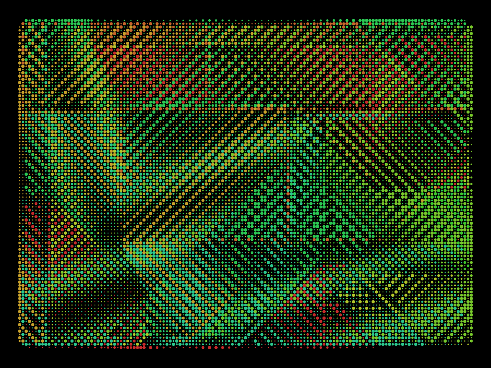

## sketch_2022_12_21d



<sup><code>rnd_seed = 21</code></sup>

Hi! This is a simplified version of the Python code that generates the `sketch_2022_12_21d` series, it produces the same compositions to the provided random seed numbers in the printed versions. 

```python
import random 
import py5  # https://py5coding.org

NBS = ((-1, -1), (-2,  0), (-1, 1), (0, -2),
       ( 0,  2), ( 1, -1), ( 2, 0), (1,  1))

step = 8
rnd_seed = 21

nodes = {}
unvisited_nodes = []

def setup():
    global nbs, colors, orientation_offset

    py5.size(1200, 900)
    py5.color_mode(py5.HSB)
    py5.rect_mode(py5.CENTER)
    py5.no_stroke()

    w = int(py5.width / 2 / step - 5)
    h = int(py5.height / 2 / step - 5)
    
    random.seed(rnd_seed)
    nbs = list(NBS)
    random.shuffle(nbs)
    colors = {nb: py5.color(i * 16, 200, 200)
              for i, nb in enumerate(nbs)}
    random.shuffle(nbs)
    orientation_offset = {nb: i * py5.PI
                          for i, nb in enumerate(nbs)}
    unvisited_nodes[:] = [(random.randint(-w, w), random.randint(-h, h))
                           for _ in range(8)]

def draw():
    unvisited_nodes[:] = grow()

    py5.background(0)
    py5.translate(py5.width / 2, py5.height / 2)
    for (x, y), (x0, y0, c, gen) in nodes.items():
        orientation = (x - x0, y - y0)  # delta/direction
        py5.fill(colors[orientation])
        d = (2 + py5.sin(gen / 5 + orientation_offset[orientation])) / 3
        py5.circle(x * step, y * step, d * step)

def grow():
    while unvisited_nodes:
        x, y = unvisited_nodes.pop()
        _, _, i, gen = nodes.get((x, y), (0, 0, len(unvisited_nodes), 0))
        if (abs(x * step) > py5.width / 2 - step * 8 or
            abs(y * step) > py5.height / 2 - step * 8):
            continue
        random.seed(rnd_seed + i)
        xnbs = random.sample(nbs, 5)
        for nx, ny in xnbs:
            xnx, yny = x + nx, y + ny
            if (xnx, yny) not in nodes:
                nodes[(xnx, yny)] = (x, y, i, gen + 1)
                yield xnx, yny

py5.run_sketch()
```
A [pyp5js version of the sketch can be explored here](https://abav.lugaralgum.com/pyp5js/pyodide/?sketch=ZnJvbSUyMHJhbmRvbSUyMGltcG9ydCUyMHNlZWQlMkMlMjBzYW1wbGUlMkMlMjByYW5kaW50JTBBZnJvbSUyMHJhbmRvbSUyMGltcG9ydCUyMHNodWZmbGUlMjBhcyUyMHJuZF9zaHUlMEElMEFOQlMlMjAlM0QlMjAoKC0xJTJDJTIwLTEpJTJDJTIwKC0yJTJDJTIwJTIwMCklMkMlMjAoLTElMkMlMjAxKSUyQyUyMCgwJTJDJTIwLTIpJTJDJTBBJTIwJTIwJTIwJTIwJTIwJTIwJTIwKDAlMkMlMjAlMjAyKSUyQyUyMCgxJTJDJTIwLTEpJTJDJTIwKDIlMkMlMjAwKSUyQyUyMCgxJTJDJTIwJTIwMSkpJTBBJTBBc3RlcCUyMCUzRCUyMDglMEFybmRfc2VlZCUyMCUzRCUyMDMyJTBBJTBBbm9kZXMlMjAlM0QlMjAlN0IlN0QlMEF1bnZpc2l0ZWRfbm9kZXMlMjAlM0QlMjAlNUIlNUQlMEElMEElMEFkZWYlMjBzZXR1cCgpJTNBJTBBJTIwJTIwJTIwJTIwc2l6ZSgxMjAwJTJDJTIwOTAwKSUwQSUyMCUyMCUyMCUyMGNvbG9yTW9kZShIU0IlMkMlMjAyNTUpJTBBJTIwJTIwJTIwJTIwbm9TdHJva2UoKSUwQSUyMCUyMCUyMCUyMHN0YXJ0KCklMEElMjAlMjAlMjAlMjAlMEFkZWYlMjBzdGFydCgpJTNBJTBBJTIwJTIwJTIwJTIwZ2xvYmFsJTIwbmJzJTJDJTIwY29sb3JzJTJDJTIwb3JpZW50YXRpb25fb2Zmc2V0JTBBJTIwJTIwJTIwJTIwdyUyMCUzRCUyMGludCh3aWR0aCUyMCUyRiUyMDIlMjAlMkYlMjBzdGVwJTIwLSUyMDUpJTBBJTIwJTIwJTIwJTIwaCUyMCUzRCUyMGludChoZWlnaHQlMjAlMkYlMjAyJTIwJTJGJTIwc3RlcCUyMC0lMjA1KSUwQSUwQSUyMCUyMCUyMCUyMHNlZWQocm5kX3NlZWQpJTBBJTIwJTIwJTIwJTIwbmJzJTIwJTNEJTIwbGlzdChOQlMpJTBBJTIwJTIwJTIwJTIwcm5kX3NodShuYnMpJTBBJTIwJTIwJTIwJTIwY29sb3JzJTIwJTNEJTIwJTdCbmIlM0ElMjBjb2xvcihpJTIwKiUyMDE2JTJDJTIwMjAwJTJDJTIwMjAwKSUwQSUyMCUyMCUyMCUyMCUyMCUyMCUyMCUyMCUyMCUyMCUyMCUyMCUyMCUyMGZvciUyMGklMkMlMjBuYiUyMGluJTIwZW51bWVyYXRlKG5icyklN0QlMEElMjAlMjAlMjAlMjBybmRfc2h1KG5icyklMEElMjAlMjAlMjAlMjBvcmllbnRhdGlvbl9vZmZzZXQlMjAlM0QlMjAlN0JuYiUzQSUyMGklMjAqJTIwUEklMEElMjAlMjAlMjAlMjAlMjAlMjAlMjAlMjAlMjAlMjAlMjAlMjAlMjAlMjAlMjAlMjAlMjAlMjAlMjAlMjAlMjAlMjAlMjAlMjAlMjAlMjBmb3IlMjBpJTJDJTIwbmIlMjBpbiUyMGVudW1lcmF0ZShuYnMpJTdEJTBBJTIwJTIwJTIwJTIwdW52aXNpdGVkX25vZGVzJTVCJTNBJTVEJTIwJTNEJTIwJTVCKHJhbmRpbnQoLXclMkMlMjB3KSUyQyUyMHJhbmRpbnQoLWglMkMlMjBoKSklMEElMjAlMjAlMjAlMjAlMjAlMjAlMjAlMjAlMjAlMjAlMjAlMjAlMjAlMjAlMjAlMjAlMjAlMjAlMjAlMjAlMjAlMjAlMjAlMjAlMjAlMjBmb3IlMjBfJTIwaW4lMjByYW5nZSg4KSU1RCUwQSUwQSUwQWRlZiUyMGRyYXcoKSUzQSUwQSUyMCUyMCUyMCUyMHVudmlzaXRlZF9ub2RlcyU1QiUzQSU1RCUyMCUzRCUyMGdyb3coKSUwQSUwQSUyMCUyMCUyMCUyMGJhY2tncm91bmQoMCklMEElMjAlMjAlMjAlMjB0cmFuc2xhdGUod2lkdGglMjAlMkYlMjAyJTJDJTIwaGVpZ2h0JTIwJTJGJTIwMiklMEElMjAlMjAlMjAlMjBmb3IlMjAoeCUyQyUyMHkpJTJDJTIwKHgwJTJDJTIweTAlMkMlMjBjJTJDJTIwZ2VuKSUyMGluJTIwbm9kZXMuaXRlbXMoKSUzQSUwQSUyMCUyMCUyMCUyMCUyMCUyMCUyMCUyMG9yaWVudGF0aW9uJTIwJTNEJTIwKHglMjAtJTIweDAlMkMlMjB5JTIwLSUyMHkwKSUyMCUyMCUyMyUyMGRlbHRhJTJGZGlyZWN0aW9uJTBBJTIwJTIwJTIwJTIwJTIwJTIwJTIwJTIwZmlsbChjb2xvcnMlNUJvcmllbnRhdGlvbiU1RCklMEElMjAlMjAlMjAlMjAlMjAlMjAlMjAlMjBkJTIwJTNEJTIwKDIlMjAlMkIlMjBzaW4oZ2VuJTIwJTJGJTIwNSUyMCUyQiUyMG9yaWVudGF0aW9uX29mZnNldCU1Qm9yaWVudGF0aW9uJTVEKSklMjAlMkYlMjAzJTBBJTIwJTIwJTIwJTIwJTIwJTIwJTIwJTIwY2lyY2xlKHglMjAqJTIwc3RlcCUyQyUyMHklMjAqJTIwc3RlcCUyQyUyMGQlMjAqJTIwc3RlcCklMEElMEElMEFkZWYlMjBncm93KCklM0ElMEElMjAlMjAlMjAlMjB3aGlsZSUyMHVudmlzaXRlZF9ub2RlcyUzQSUwQSUyMCUyMCUyMCUyMCUyMCUyMCUyMCUyMHglMkMlMjB5JTIwJTNEJTIwdW52aXNpdGVkX25vZGVzLnBvcCgpJTBBJTIwJTIwJTIwJTIwJTIwJTIwJTIwJTIwXyUyQyUyMF8lMkMlMjBpJTJDJTIwZ2VuJTIwJTNEJTIwbm9kZXMuZ2V0KCh4JTJDJTIweSklMkMlMjAoMCUyQyUyMDAlMkMlMjBsZW4odW52aXNpdGVkX25vZGVzKSUyQyUyMDApKSUwQSUyMCUyMCUyMCUyMCUyMCUyMCUyMCUyMGlmJTIwKGFicyh4JTIwKiUyMHN0ZXApJTIwJTNFJTIwd2lkdGglMjAlMkYlMjAyJTIwLSUyMHN0ZXAlMjAqJTIwOCUyMG9yJTBBJTIwJTIwJTIwJTIwJTIwJTIwJTIwJTIwJTIwJTIwJTIwJTIwJTIwJTIwJTIwJTIwYWJzKHklMjAqJTIwc3RlcCklMjAlM0UlMjBoZWlnaHQlMjAlMkYlMjAyJTIwLSUyMHN0ZXAlMjAqJTIwOCklM0ElMEElMjAlMjAlMjAlMjAlMjAlMjAlMjAlMjAlMjAlMjAlMjAlMjBjb250aW51ZSUwQSUyMCUyMCUyMCUyMCUyMCUyMCUyMCUyMHNlZWQocm5kX3NlZWQlMjAlMkIlMjBpKSUwQSUyMCUyMCUyMCUyMCUyMCUyMCUyMCUyMHhuYnMlMjAlM0QlMjBzYW1wbGUobmJzJTJDJTIwNSklMEElMjAlMjAlMjAlMjAlMjAlMjAlMjAlMjBmb3IlMjBueCUyQyUyMG55JTIwaW4lMjB4bmJzJTNBJTBBJTIwJTIwJTIwJTIwJTIwJTIwJTIwJTIwJTIwJTIwJTIwJTIweG54JTJDJTIweW55JTIwJTNEJTIweCUyMCUyQiUyMG54JTJDJTIweSUyMCUyQiUyMG55JTBBJTIwJTIwJTIwJTIwJTIwJTIwJTIwJTIwJTIwJTIwJTIwJTIwaWYlMjAoeG54JTJDJTIweW55KSUyMG5vdCUyMGluJTIwbm9kZXMlM0ElMEElMjAlMjAlMjAlMjAlMjAlMjAlMjAlMjAlMjAlMjAlMjAlMjAlMjAlMjAlMjAlMjBub2RlcyU1Qih4bnglMkMlMjB5bnkpJTVEJTIwJTNEJTIwKHglMkMlMjB5JTJDJTIwaSUyQyUyMGdlbiUyMCUyQiUyMDEpJTBBJTIwJTIwJTIwJTIwJTIwJTIwJTIwJTIwJTIwJTIwJTIwJTIwJTIwJTIwJTIwJTIweWllbGQlMjB4bnglMkMlMjB5bnklMEElMEElMEElMEElMEE%3D)

The actual code I used to generate the prints has a few tweaks: It has the `unvisited_nodes[:] = grow()` line inside a `while` loop in order to produce a finished composition in a single frame, it has also  `Py5Graphics` image buffer to provide a higher resolution output.
